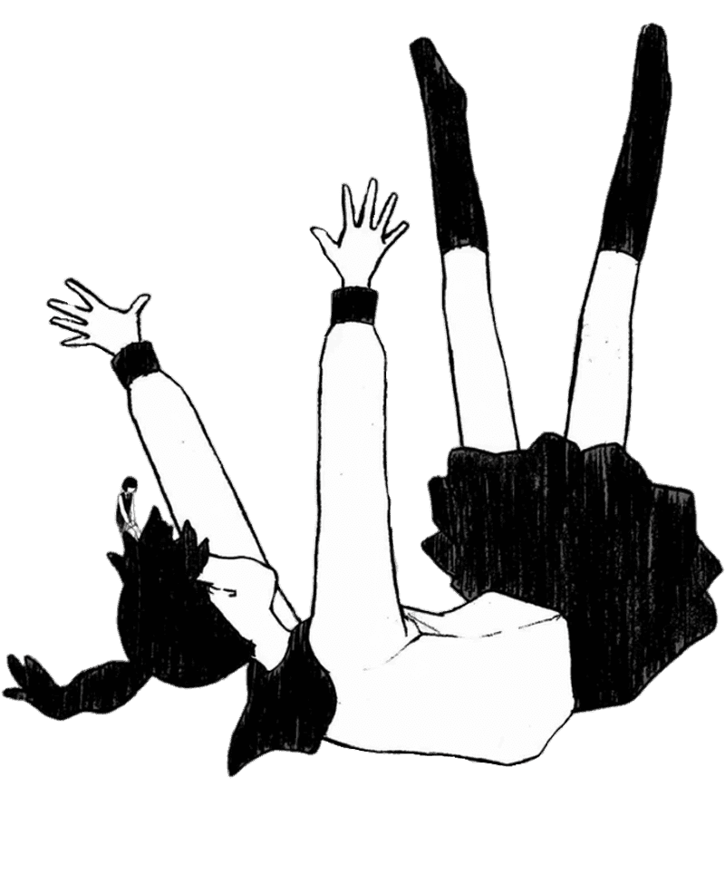

### Hi there 👋

#### Undergraduate of [@SUSTech](https://www.sustech.edu.cn/en/), 2021 batch

This account is primarily utilized for recording the code of my course at SUSTech. 

#### Almost all my course projects are available on GitHub. Welcome to star⭐~

📦 Course Repo 

Course Project Repositories:

- [【Java1A - 国际象棋】CS102/109A Java: Chess ](https://github.com/OctCarp/SUSTech_CS102A-JavaA_S22_Proj-Chess)
- [【数字逻辑 - 小车】CS207 DD: "A Real Car"](https://github.com/OctCarp/SUSTech_CS207-DD_2022f_Project-a-real-car)
- [【计组 - 单周期 CPU】CS202 Organization: Single Cycle CPU](https://github.com/OctCarp/SUSTech_CS202-Organization_2023s_Project-CPU)
- [【数据库 - 论坛】CS307 DB: Forum Database](https://github.com/OctCarp/SUSTech_CS307-DB_2023s_Projects)
- [【计网 - Ryu SDN】CS305 Network: Ryu Controller SDN](https://github.com/OctCarp/SUSTech_CS305-Network_2023s_Project-Ryu)
- [【OOAD - 宿舍选择】 CS309 OOAD: Dormitory Selection](https://github.com/OctCarp/SUSTech_CS309-OOAD_F23_Proj-Dorm-Select)
- [【嵌入式 - “智能手表”】CS301 Embedded Syst.: "Smart Watch"](https://github.com/Mark4551124015/SUSTech_CS301_Project)
- [【C++ - 递归推箱】CS205 C/C++: Recurse Box](https://github.com/SUSTech-CPP-Recurse-Box/Sokoban)
- [【Java2 - 爬虫与可视化】 CS209A Java2: Data Crawling & Visualization ](https://github.com/OctCarp/SUSTech_CS209A-Java2_F24_Proj)

Course Assignment Repositories:

- [【JavaA】CS102/109A 2022 Spring - Assignment](https://github.com/OctCarp/SUSTech_CS102A-JavaA_S22_Works)
- [【DSAA】CS203 2022 Fall - Lab](https://github.com/OctCarp/SUSTech_CS203-DSAA_F22_Works)
- [【Algorithm】CS208 2023 Spring - Lab](https://github.com/OctCarp/SUSTech_CS208-Algorithm_S23_Works)
- [【AI】CS303 2023 Fall - Lab](https://github.com/OctCarp/SUSTech_CS303-AI_F23_Works)
- [【C/C++】CS205 2023 Fall - Midterm & Lab](https://github.com/OctCarp/SUSTech_CS205-CPP_F23_Works)
- [【Deep Learning】CS324 2024 Spring - Assignment](https://github.com/OctCarp/SUSTech_CS324-Deep-Learning_S24_Works)
- [【OS】CS302 2024 Spring - Assignment](https://github.com/OctCarp/SUSTech_CS302-OS_S24_Works)
- [【MATLAB】ME112 2024 Spring - Assignment](https://github.com/OctCarp/SUSTech_ME112-MATLAB_S24_Works)
- [【Distributed】CS328 2024 Fall - Assignment](https://github.com/OctCarp/SUSTech_CS328-Distributed_F24_Works)
- [【Java2】CS209A 2024 Fall - Assignment & Lab](https://github.com/OctCarp/SUSTech_CS209A-Java2_F24_Works)
- [【Other】Miscellaneous](https://github.com/OctCarp/SUSTech_CS-Course_MISC)

I'd like to have a work-life balance (though I don't really have it). So, I've usually only focused on meeting the requirements that contribute to the grade.

I hope to engage in some interesting additional exploration or extension in my leisure time.

  <picture style="margin-right: 0.5rem;">
    <source
      srcset="https://github-readme-stats.vercel.app/api?username=OctCarp&show_icons=true&count_private=true&hide_rank=true&hide_border=true&disable_animations=true&theme=apprentice"
      media="(prefers-color-scheme: dark)" />
    
  </picture>
  <picture style="margin-left: 0.5rem;">
    <source
      srcset="https://github-readme-stats.vercel.app/api/top-langs/?username=OctCarp&layout=compact&hide=tex&langs_count=8&hide_progress=true&size_weight=0.5&count_weight=0.5&hide_border=true&disable_animations=true&theme=apprentice"
      media="(prefers-color-scheme: dark)" />
    
  </picture>

